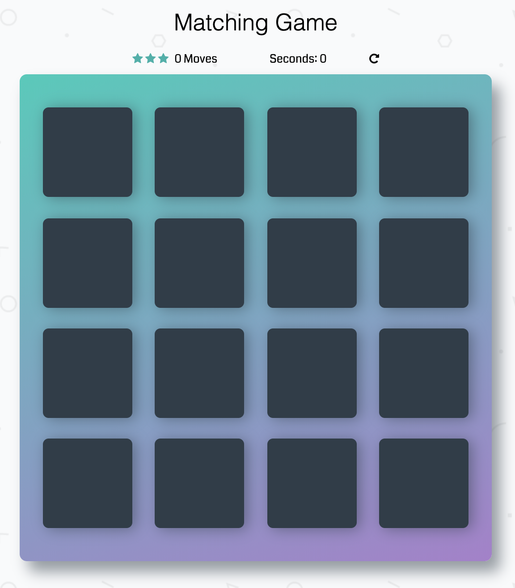

# Memory Game

This memory game was created as part of the Udacity Front-End Web Developer Nanodegree. It meets the requirements of the course. [Test it on Github Pages](https://philippherzig.github.io/udacity-memory-game/)

## How To Play
The game is won by the player who successfully unfolds all card pairs. Cards that do not match are hidden again. Try to finish the game as fast as possible and with as few clicks as possible. Depending on how many clicks you need you will achieve one, two or three stars.

## Install
Simply download or clone this repository and run index.html in a local browser or place it on a web server.

## Credits
* HTML and CSS is based on the [starter project provided by Udactiy](https://github.com/udacity/fend-project-memory-game)
* Icons by [Font Awesome](https://fontawesome.com)
* Code Font by [Google Fonts](https://fonts.google.com/specimen/Coda)
